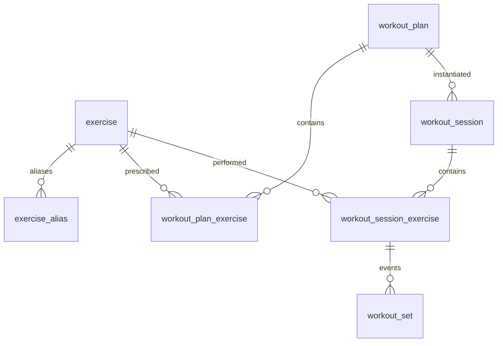

# Strong CSV + Bybon Domain → DB Schema

Analysis of Strong export format vs Bybon’s workout domain, and a proposed SQLite/Room schema that
supports both Strong import (fidelity-preserving) and Bybon’s own plan/session model.

Decisions locked in:

1. **Import fidelity (1A):** preserve Strong extras (warmups, rest timers, notes,
   RPE/distance/time).
2. **Plan linkage:** every session has a `plan_id`. On import, match Strong workout name to an
   existing Bybon plan; otherwise create an **archived** plan from the name and exercise list.

Schema only — no Room entities, DAOs, or importer code in this doc.

---

## Strong CSV schema

Delimiter: `;`. One row per set-like event (working set, warmup, rest timer, or note). Workout-level
fields are repeated on every row.

| Column              | Type in CSV           | Meaning                                                                  |
|---------------------|-----------------------|--------------------------------------------------------------------------|
| `Workout #`         | int                   | Session identity (1…252 in `strong-backup.csv`)                          |
| `Date`              | `yyyy-MM-dd HH:mm:ss` | Session start                                                            |
| `Workout Name`      | string                | Free-text session/plan name                                              |
| `Duration (sec)`    | int                   | Total session duration                                                   |
| `Exercise Name`     | string                | Display name only (no id)                                                |
| `Set Order`         | string enum-ish       | `W` warmup, `1`…`N` working set, `Rest Timer`, `Note`                    |
| `Weight (kg)`       | decimal or empty      | Load                                                                     |
| `Reps`              | int or empty          | Reps                                                                     |
| `RPE`               | decimal or empty      | Present in format; **0 uses in this backup**                             |
| `Distance (meters)` | decimal or empty      | Present; **0 uses**                                                      |
| `Seconds`           | decimal or empty      | Rest duration when `Set Order=Rest Timer`; also available for timed work |
| `Notes`             | string                | Per-exercise note when `Set Order=Note`                                  |
| `Workout Notes`     | string                | Session note (repeated per row)                                          |

**Row kinds in this backup:** working sets (~5480), warmups `W` (1410), `Rest Timer` (2600, seconds
filled), `Note` (90). No RPE/distance/timed-work rows.

### Example: Workout #252 (abbreviated)

- **Session:** `#252`, `2026-08-20 17:59:34`, name `"Upper body B "`, duration `3367`s, notes
  `"Full body B without legs"`
- **Exercises (order):** Incline Bench Press (Dumbbell) → Incline Row (Dumbbell) → Incline Curl
  (Dumbbell) → Lateral Raise (Machine) → Crunch (Machine)
- **Per exercise pattern (bench):** optional `Note` → `W` warmups → working `1..N` interleaved with
  `Rest Timer` (e.g. 120s) carrying weight/reps on set rows only

---

## Bybon domain model

From
[`WorkoutPlan.kt`](../app/src/main/java/dev/sanastasov/bybon/workout/domain/WorkoutPlan.kt),
[`WorkoutSession.kt`](../app/src/main/java/dev/sanastasov/bybon/workout/domain/WorkoutSession.kt),
[
`ExerciseDefinition.kt`](../app/src/main/java/dev/sanastasov/bybon/workout/domain/ExerciseDefinition.kt):

- **`ExerciseDefinition`**: stable `id`, `name`, `primaryMuscleGroup`, `equipment` (catalog today is
  in-memory).
- **`WorkoutPlan`**: `WorkoutPlanId`, `name`, `description?`, ordered `PlanedExercise` list
  (`exercise`, prescribed `sets: Int`, `repRange: IntRange`).
- **`WorkoutSession`**: always tied to `planId` + denormalized `planName`/`planDescription`; ordered
  `WorkoutExercise`s; `WorkoutState` = NotStarted | InProgress(startedAt) | Completed(startedAt,
  duration).
- **`WorkoutExercise`**: exercise def + target `repRange` + list of `ExerciseSet`.
- **`ExerciseSet`**: weight (stored as tenths of kg), reps, `SetState` (NotStarted / InProgress /
  Completed). At most one InProgress set per session.
- No first-class warmup, rest timer, RPE, distance, timed sets, or per-set/per-exercise notes in the
  domain today.

---

## Differences / incompatibilities

| Concern           | Strong                                                                                                       | Bybon                                        | Schema impact                                                                                          |
|-------------------|--------------------------------------------------------------------------------------------------------------|----------------------------------------------|--------------------------------------------------------------------------------------------------------|
| Identity          | Numeric workout #, name-only exercises                                                                       | String plan/exercise ids                     | Stable local UUIDs + Strong external keys / name aliases                                               |
| Plan vs session   | Name only; no plan entity                                                                                    | Session always has `planId`                  | Import matches plan by name, else creates **archived** plan from name + exercise list                  |
| Prescription      | None in CSV                                                                                                  | Plan has sets + rep range                    | Plan tables hold prescription; imported archived plans can store observed set counts / null rep ranges |
| Set kinds         | `W`, working, Rest Timer, Note                                                                               | Working sets + lifecycle state only          | Discriminated set/event rows; Bybon UI reads working sets                                              |
| Rest              | Separate timer rows with seconds                                                                             | Not modeled                                  | Store as rest events                                                                                   |
| Metrics           | weight, reps, RPE, distance, seconds                                                                         | weight + reps                                | Nullable columns for Strong extras                                                                     |
| Notes             | Workout notes + exercise Note rows                                                                           | Plan description only                        | Session notes + exercise notes                                                                         |
| Units / precision | kg decimals (`32.5`)                                                                                         | `Weight` as tenths of kg                     | Store weight as INTEGER tenths (325 = 32.5 kg)                                                         |
| Live state        | History only (completed)                                                                                     | NotStarted/InProgress/Completed + set states | Session/set state columns for live Bybon use; Strong imports → Completed                               |
| Catalog gap       | 42 Strong names; several missing/mismatched vs Bybon list (e.g. Crunch, Band fly, Hip Thrust, naming/casing) | Fixed catalog                                | `exercise` table + `exercise_alias` for Strong name → id                                               |

**Import rule:** every session gets a `plan_id`. Match Strong `Workout Name` (trimmed,
case-insensitive) to existing plan names; if no match, create an **archived** plan named after
Strong, with plan exercises derived from the session’s exercise order (set count from working sets;
rep range nullable or min..max observed).

---

## Proposed SQLite / Room schema

Aligned with existing Room DB
([`BybonDatabase`](../app/src/main/java/dev/sanastasov/bybon/data/BybonDatabase.kt)).

### `exercise`

- `id` TEXT PK (e.g. `incline-bench-press-db`)
- `name` TEXT NOT NULL
- `primary_muscle_group` TEXT NOT NULL
- `equipment` TEXT NOT NULL
- `archived` INTEGER NOT NULL DEFAULT 0  
  *(import-created exercises unknown to Bybon catalog can be archived=1)*

### `exercise_alias`

- `alias_name` TEXT PK (exact Strong `Exercise Name` string)
- `exercise_id` TEXT NOT NULL FK → `exercise(id)`

### `workout_plan`

- `id` TEXT PK
- `name` TEXT NOT NULL
- `description` TEXT NULL
- `archived` INTEGER NOT NULL DEFAULT 0  
  *(Strong-only / unmatched names → archived=1)*
- `source` TEXT NOT NULL DEFAULT `'bybon'` (`bybon` | `strong_import`)
- UNIQUE(`name`) optional later; for import matching use normalized name lookup in app code

### `workout_plan_exercise`

- `plan_id` TEXT NOT NULL FK → `workout_plan(id)`
- `position` INTEGER NOT NULL
- `exercise_id` TEXT NOT NULL FK → `exercise(id)`
- `prescribed_sets` INTEGER NULL  
  *(required for live Bybon plans; for archived import plans = count of working sets from template
  session or first occurrence)*
- `rep_min` INTEGER NULL
- `rep_max` INTEGER NULL
- PRIMARY KEY (`plan_id`, `position`)

### `workout_session`

- `id` TEXT PK
- `plan_id` TEXT NOT NULL FK → `workout_plan(id)`  
  *(always set; never null)*
- `plan_name` TEXT NOT NULL  
  *(denormalized snapshot at start/import)*
- `plan_description` TEXT NULL
- `started_at` TEXT NOT NULL  
  *(ISO-8601 / Strong Date)*
- `duration_sec` INTEGER NULL  
  *(set when completed; Strong Duration)*
- `state` TEXT NOT NULL  
  *(`not_started` | `in_progress` | `completed`)*
- `notes` TEXT NULL  
  *(Strong Workout Notes)*
- `strong_workout_number` INTEGER NULL UNIQUE  
  *(idempotent Strong re-import)*
- `source` TEXT NOT NULL DEFAULT `'bybon'`

### `workout_session_exercise`

- `id` TEXT PK
- `session_id` TEXT NOT NULL FK → `workout_session(id)` ON DELETE CASCADE
- `position` INTEGER NOT NULL
- `exercise_id` TEXT NOT NULL FK → `exercise(id)`
- `rep_min` INTEGER NULL  
  *(snapshot from plan; null for pure Strong history)*
- `rep_max` INTEGER NULL
- `notes` TEXT NULL  
  *(merged Strong `Set Order=Note` text for that exercise)*
- UNIQUE (`session_id`, `position`)

### `workout_set` (working sets, warmups, and rest events)

- `id` TEXT PK
- `session_exercise_id` TEXT NOT NULL FK → `workout_session_exercise(id)` ON DELETE CASCADE
- `position` INTEGER NOT NULL  
  *(CSV row order within the exercise)*
- `kind` TEXT NOT NULL  
  *(`warmup` | `working` | `rest`)*  
  *(Note rows are not sets — stored on `workout_session_exercise.notes`)*
- `set_number` INTEGER NULL  
  *(Strong working index 1..N; null for warmup/rest)*
- `weight_tenths_kg` INTEGER NULL  
  *(325 = 32.5 kg; null for rest)*
- `reps` INTEGER NULL
- `rpe_tenths` INTEGER NULL  
  *(optional Strong RPE)*
- `distance_meters` REAL NULL
- `duration_sec` REAL NULL  
  *(rest target or timed-set duration)*
- `state` TEXT NOT NULL DEFAULT `'completed'`  
  *(`not_started` | `in_progress` | `completed`) — Strong import always `completed`; warmups/rest
  can use `completed` or ignore in UI*
- `notes` TEXT NULL  
  *(per-set notes if ever needed)*
- UNIQUE (`session_exercise_id`, `position`)

**Constraint (app-enforced, same as domain):** at most one `workout_set` with `state='in_progress'`
per session.

---

## How the two models map

**Bybon live session:** plan → session (`plan_id` required) → session exercises with rep range
snapshot → `kind='working'` sets with `state` lifecycle. Warmup/rest unused unless product adds them
later.

**Strong import:**

1. Upsert exercises (match alias / normalized name; else create archived exercise).
2. Resolve `plan_id`: match plan by trimmed name; else insert archived `workout_plan` +
   `workout_plan_exercise` from that workout’s exercise order.
3. Insert `workout_session` (`state=completed`, Strong date/duration/notes/`strong_workout_number`).
4. For each exercise block: session exercise + ordered `workout_set` rows (`W`→warmup,
   digits→working, `Rest Timer`→rest); concatenate `Note` rows into exercise `notes`.
